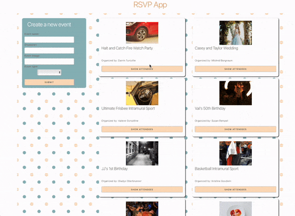

# React Lifing State Lab

Edit multiple JavaScript files in this lab to refactor this app to have multiple components that function as expected.

---

## Lab Setup

### Getting started

1. Fork and clone this repository.

1. Navigate to the cloned repository's directory on your command line. Then, run the following command:

   ```
   npm install
   ```

   This will install the libraries needed.

1. Open up the repository in VSCode. Follow the instructions below to complete the Lab.

1. Deploy this application to Netlify and add the link to your netlify site below:

- [MY LIVE SITE URL]()

## Instructions

You have a fully functional app. It can:

- Show a list of events
- Create a new event through a form that gets added to the list of events
- Toggles the attendance of any attendee per event
- Toggles show/hide attendee list\*

> **Note:** In the app's present state, when you toggle show/hide attendees it toggles show/hide for all events. Your job will be to create components with their own state so that only the event that is selected has its attendees view toggled to fix this bug (pass the final Cypress test).

You should move the JSX into the correct components:

- **Header**. `header` is top level HTML element.
- **Footer**. `footer` is top level HTML element.
- **NewEventForm**. `form` is top level HTML element.
- **Event**. `li` with className `event` is the top level HTML element.
- **Attendees**. `button` with text `Show/Hide Attendees` and `div` with className `attendees` are the top level HTML elements.
- **Attendee**. `div` with className `attendee` is the top level HTML element.

You should maintain the same HTML element heiarchy (you should not need to add or edit HTML elements), however, you will need to move the HTML elements into different components. The filenames and functional component shells are already included in the starter code.

You must pass props down, add state to some of the new components, and lift state in other places to maintain functionality and fix the bug in the app.


